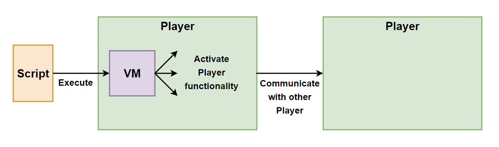

# Polymorph Personal Compute Platform
The Polymorph platform is a Personal Compute Platform intended to enable individual users to better utilize their
personal computers. This includes supporting common personal computing use cases on the user's local PC - as well as 
communication with other user's PC. 

Even though the primary target users are personal users - several of the technologies coming out of the Polymorph
project can be used for commercial use cases too - both in small companies and in larger enterprises.

Here is an introduction video to the Polymorph Personal Compute Platform:

https://www.youtube.com/watch?v=2M7R7b1UHxE&list=PLL8woMHwr36Fw_IYQuw1E7-B-cCEHaDQe&index=2=

## Table of Contents
 - [Polymorph Ues Cases](#Polymorph-Use-Cases)
 - [Polymorph Innovation](#Polymorph-Innovation)
 - [Polymorph Technology Overview](#Polymorph-Technology-Overview)
 - [Polymorph Player](#Polymorph-Player)
 - [Polymorph Tools](#Polymorph-Tools)
 - [Polymorph Standards](#Polymorph-Standards)
   - [Polymorph Data Encoding and Polymorph Data Language](#Polymorph-Data-Encoding-and-Polymorph-Data-Language)
 - [Polymorph Fabric](#Polymorph-Fabric)

## Polymorph Use Cases
Below is a list of the personal computing use cases that Polymorph could address.
Exactly which use cases will be addresses and in what sequence - is not yet determined.
The use cases below are just examples, so far.

- Dynamic Interactive Media (DIM)
  - Slides
  - Documents 
  - Recipes (cooking, tech runbooks etc.)
  - Books
  - Spreadsheets / Notebooks
  - Charts
  - Diagrams
  - Lists (shopping lists, todo lists etc.)
  - Notes
  - Photos
  - Audiobooks
  - Podcasts
  - Music
  - Video
  - Etc.

- Personal Applications 
  - Chat
  - Mail
  - Video conferences
  - File sharing / backup
  - Etc.

Dynamic Interactive Media (DIM) is probably the first area this project will focus on.
First of all, DIM covers a lot of common personal computing use cases. Secondly, many DIM use cases only require
one-way communication - meaning the data (slides, photos etc.) is loaded from a local disk, remote PC or a server, 
and displayed as is. There is no need to send any information back to the source of the data.

Personal Applications will require two-way communication between the user + Polymorph Player  
and the application code itself. This is true whether the application runs inside Polymorph Player, runs 
as a separate process connected to Polymorph Player on the same PC, or runs on a remote PC or server. 

## Polymorph Innovation
The full ambitions of the Polymorph Platform project cannot be achieved using any existing technologies.
Web tech cannot get us there. No existing application platforms can get us there. Therefore, the Polymorph project
needs to invent its own technology stack. 

Even though the Polymorph technologies are designed primarily for use within the Polymorph ecosystem,
several of these technologies can be used outside the Polymorph ecosystem as well.

### Web Technology Deficiencies
Here is why I do not believe that the current web technology stack can implement what Polymorph wants to achieve: 

[Web Technology Deficiencies](web-technology-deficiencies.md)

## Polymorph Technology Overview
To be able to support the use cases listed earlier, the Polymorph Personal Compute Platform needs a set of
underlying general purpose technologies. Figuring out the full set of necessary technologies is an ongoing process.
Just like web technologies were not all developed on day one of the web, the Polymorph technologies will not all be 
developed on day one of the Polymorph platform.

So far, the Polymorph platform consists of the following parts:

- Polymorph Player
- Polymorph Tools
    - Polymorph PDE reader and writer
    - Polymorph PDL parser
    - Polymorph PDL to PDE + PDE to PDL converter
    - Polymorph VM
- Polymorph Standards (PDE, PDL etc.)
    - Polymorph Data Encoding
    - Polymorph Data Language
    - Polymorph VM specification
    - Polymorph Polyring P2P topology
- Polymorph Fabric

The Polymorph Player is a desktop application that provides a lot of general purpose, and special purpose,
functionality. You activate that functionality by executing scripts that call functions inside the Polymorph Player,
a bit like running a Java application inside a Java Virtual Machine. Polymorph Player just provides functionality at a higher
abstraction level than the Java VM. The Polymorph Player is intended to be the primary human interface to the
Polymorph Platform. Hence, Polymorph Player is also sometimes referred to as the Polymorph Human Interface (PHI).

The Polymorph Tools are tools that provide lower level functionality. The Polymorph Player uses the Tools internally.
For instance, the compiler and VM for the script language the Player can execute - are located in the Tools library.

The Polymorph Standards are open standards that are used inside the Polymorph Platform, but which
can also be implemented and used outside of the Polymorph Platform. These standards include the
Polymorph Data Encoding (PDE) and Polymorph Data Language (PDL) among others.

The Polymorph Fabric is intended to be a communication fabric via which individual Player apps can
communicate with each other - in a peer-to-peer (P2P) fashion.

Here is a diagram illustrating the intended usage of the Polymorph platform parts:

## Polymorph Player
Polymorph Player is an application designed to run on desktop computers. 
Polymorph Player is intended to be the human interface to the Polymorph platform. 

Polymorph Player will come with a lot of functionality built in that is useful to individual users. 
Exactly what that functionality will be - is not fully decided - and it will probably expand over time too. 

## Polymorph Tools
The Polymorph Tools are toolkits that enable you to use Polymorph technologies outside the Polymorph platform -
in your own systems.

The Polymorph toolkits also provide proof-of-concept implementations of many of the Polymorph technologies
(e.g. standards).

Here is the first toolkit with Java implementations:

(https://github.com/jjenkov/polymorph-tools-java)

## Polymorph Standards
The Polymorph Standards are standards that specify the technologies used inside the Polymorph Platform.
The standards are open - so anyone can implement them and use them in their own systems.

### Polymorph Data Encoding and Polymorph Data Language
Polymorph Data Encoding (PDE) and Polymorph Data Language (PDL) are two data formats that are used to encode data
used internally by the other Polymorph parts.

Polymorph Data Encoding (PDE) is a binary encoding that is compact and fast to read and write.
PDE uses an encoding that is similar to MessagePack and CBOR, but with some changes that
makes it easier and faster to navigate in its binary form. It also contains some data types that
MessagePack and CBOR does not.

Polymorph Data Language (PDL) is a textual version of PDE that is easy to open and read and write in a text editor.
You can convert PDE to PDL and PDL to PDE. The syntax of PDL looks similar to JSON but with some changes to
make it able to model PDE data structures, and for making PDL easier and faster to tokenize than JSON.

You can find the PDE and PDL specifications in their own GitHub repository here:

(https://github.com/jjenkov/pde-pdl-specification/tree/main)

## Polymorph Fabric
Polymorph Fabric is a communication fabric that makes it easy for individual users of Polymorph to 
exchange data with each other. 

Polymorph Fabric is intended to support:

 - Local communication between Polymorph Player apps on the same PC.
 - Communication between Polymorph Player apps on different PCs via the Polymorph Polyring P2P topology.

