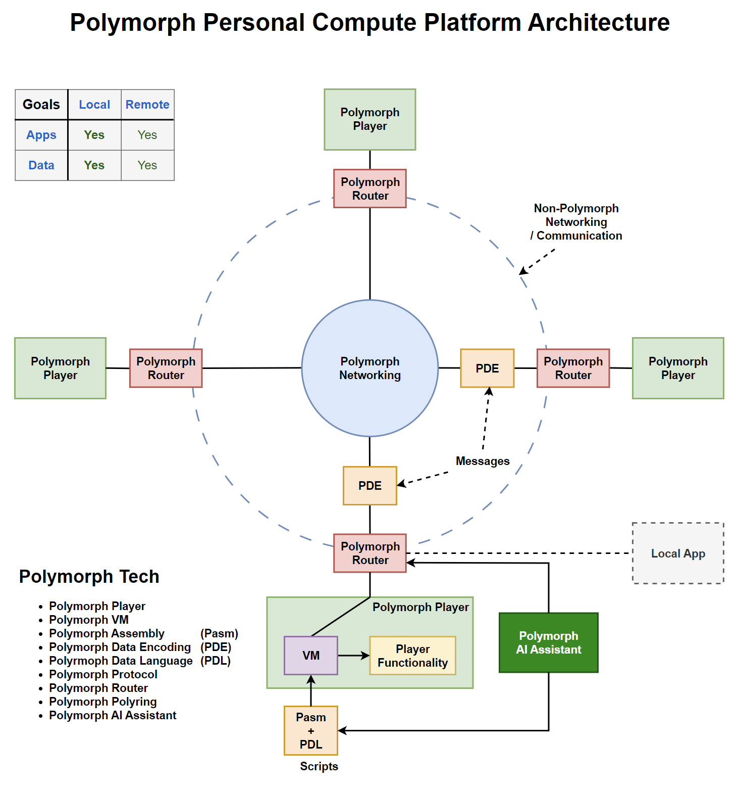

# Polymorph Personal Compute Platform

The Web technology stack is, in my opinion, not the right technology stack for personal computing.
The purpose of the Polymorph Personal Compute Platform project is to reimagine personal computing in the Internet age.

## Personal Computing
The two primary themes of personal computing are:

- Local apps
- Local data

However, in the Internet age we want network communication too, so you can share data with other users
more easily. Or - share data between your own computers more easily.

## The Polymorph Project
The Polymorph project aims at providing a wide variety of common personal computing functionality that is easily accessible
within a single, coherent, flexible platform. This platform runs locally, uses local data, and can communicate 
with other users and computers via local networks or the Internet.

Even though the primary target users are personal users – several of the technologies coming out of the Polymorph
project can be used for commercial use cases too – both in small companies and in larger enterprises.

## Table of Contents
- Polymorph Project Documentation
  - [Polymorph Project Motivation](docs/polymorph-project-motivation.md)
  - [Polymorph Project Goals](docs/polymorph-project-goals.md)
  - [Polymorph Use Cases](docs/polymorph-use-cases-and-functionality.md)
  - [Polymorph Technology Overview](docs/polymorph-technology-overview.md)
  - [Polymorph Data Encoding and Polymorph Data Language Introduction](docs/pde-pdl-introduction.md)
  - [Polymorph Data Language Syntax Design](docs/pdl-syntax-design.md)
  - [Polymorph Data Language Benchmarks](docs/pdl-benchmarks.md)
  - [Top-down Virtual Machines vs. Bottom-up Virtual Machines](docs/top-down-vms-vs-bottom-up-vms.md)
  
- Polymorph Videos
  - [YouTube Playlist](https://www.youtube.com/playlist?list=PLL8woMHwr36Fw_IYQuw1E7-B-cCEHaDQe)
  - [Polymorph Data Language](https://www.youtube.com/watch?v=TnCtl7hBfzM&list=PLL8woMHwr36Fw_IYQuw1E7-B-cCEHaDQe&index=2)

- Polymorph Specifications
  - [Polymorph Data Encoding (PDE)](specifications/pde-specification.md) 
  - [Polymorph Data Language (PDL)](specifications/pdl-specification.md)

- Polymorph Project Plan
  - [Task Board](https://github.com/users/jjenkov/projects/1/views/2)
  - [Task List](https://github.com/users/jjenkov/projects/1/views/4)
  - [Roadmap](https://github.com/users/jjenkov/projects/1/views/3)

- Additional Information
  - [Web Technology Deficiencies](docs/web-technology-deficiencies.md)

## Polymorph Architecture Overview

The Polymorph Player can be used in standalone mode, meaning you have all your data and your scripts locally.
However, the Polymorph Player can also be used in a distributed mode - capable of communicating with other 
Polymorph Player instances. You can share data with other Player instances via your own sharing mechanisms,
or use some of the networking capabilities that will be built into the Polymorph Personal Compute Platform
in the future.

- PDL + PDE are used to represent data.
- Pasm is used to represent simple scripts for interacting with the Player.
- The VM is embedded in the Player, and can executed Pasm + PDL / PDE
- The Player functionality can be activated via the Pasm scripts via the VM.
- The Router can be used to communicate locally with other apps, or remotely with other Players or apps.
- The Polyring is a flexible P2P network topology that can be used to implement many different styles of topologies.
- The AI Assistant will make it easier for less technical users to interact with the Polymorph platform.

## Directory Descriptions

The `docs` directory contains various documentation about the Polymorph Personal Compute Project.

The `resources` directory contains various additional resources, such as graphics displayed in Markdown files, screenshots etc.

The `specifications` directory contains the official Polymorph specifications such as Polymorph Data Encoding and Polymorph Data Language.

The `polymorph-player-java-javafx` directory contains a Java + JavaFX implementation of the Polymorph Player.
The Polymorph Player is a desktop application that can execute scripts written by users to activate the Player's embedded functionality.

The `polymorph-tools-java` directory contains a set of tools for using Polymorph technologies, such as PDL, PDE, etc.
The code in this directory can be used outside of the Polymorph Player project (e.g. in your own projects).

## Contributing

The Polymorph Personal Compute Platform project has turned out to be rather research-heavy - at least for now.
This means that it is not easy to just "take an issue and implement it". You need a lot of background knowledge to 
complete most tasks at this point. 

But - that does not mean you cannot contribute!

The Polymorph project will most likely be 

 - Idea-heavy
 - Code-light

The most important parts of this project are the ideas that come out of it. The ideas that result from the research.
If the ideas are good and simple enough, there could potentially be many implementations of them – also outside 
the Polymorph project. If the descriptions are precise enough, implementations could potentially be made using AI.

Thus, the best ways to contribute to the Polymorph project are:

1) New ideas for functionality.
2) Research into how to design and implement this new functionality.
3) Validation of "completed" or ongoing research by scrutinizing the ideas and testing the ideas in practice.
4) Use the technologies and provide feedback about what works, what could be improved, or what should be removed.
5) Feedback on existing implementations.
6) Tell others about the project, ideas, and implementations.
7) Forming local communities around the Polymorph project (when the project matures).

Often, a high-quality implementation of an idea requires that you know all the details about that idea.
Additionally, during the implementation you may realize that the idea needs to be tweaked to make the implementation
easier, faster, more extendable, more composable, etc. Therefore, it is not always easy to implement an idea you 
have not created or studied – meaning it is not as easy to contribute with the concrete implementations.  

For instance, I have been working more than 1 year just on the design of PDL. In my spare-time, on/off etc. – but
still. A lot of time and effort has gone into ideation, experimentation, benchmarking, and modifications of the idea, until I 
arrived at what I believe to be the best compromise between all its design goals. 
The final PDL tokenizer implementation, however, is only around 30 lines of code plus a lookup table.  

The situation is similar for several other parts of this project. I spent just as much time on specifying PDE as I did for PDL.
Coming up with good designs is the hard part. Implementing them is often easier or is done incrementally during the ideation process.
So, there are many other, more valuable ways to contribute than "writing code".

Additionally, the deeper the Polymorph community understands the ideas – the stronger the community and the
technology become. The project might move slower – but the results will be better.

So - the best way you can contribute to the Polymorph project is at the ideation, validation, feedback, and propagation
level. The implementation level is important too, of course, but somewhat secondary. With good ideas we will get the
implementations done sooner or later, using AI or by hand.